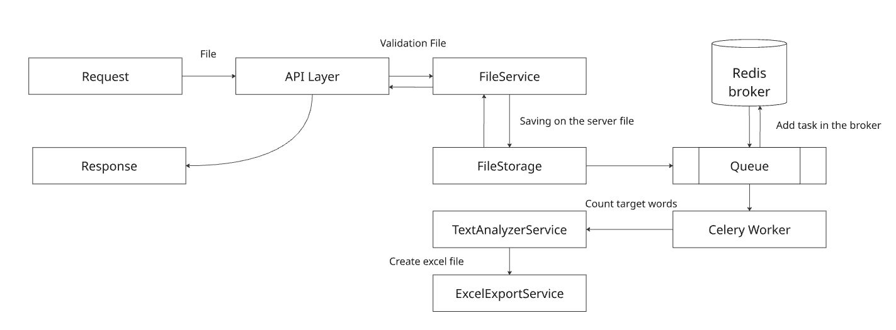

# Тестовое задания на вакансию «Стажёр backend-разработчик»

## Техническое задание

С помощью FastAPI реализовать функцию /public/report/export которая на вход получает текстовой файл. Текстовой файл содержит строки слов. Кол-во строк и размер строк неограничен, поэтому файл может быть довольно большим (от килобайт до гигабайтов).
Необходимо собрать частотную статистику по словоформам («житель» и «жителем» - это одно слово) – словоформа; кол-во во всём документе; кол-во в каждой из строк.
Результат записать в excel (xlsx) в виде трёх столбцов: словоформа; кол-во данной словоформы во всём документе; кол-во словоформ в каждой строке (в виде строки, например “0,11,32,0,0,3”).

Можно использовать любые необходимые сторонние библиотеки.
Учесть ситуацию, когда API будет вызвано несколькими пользователями и будут переданы для анализа огромные файлы. Данный случай не должен привести к тому, что система будет полностью недоступна для других пользователей.
Оформление кода с использованием одной из методологий формирования кода (типа DDD), приветствуется.

## Архитектурные решения

Первым делом необходимо разбить задачу на подзадачи, над которыми необходимо будет провести анализ и выбор соответсвующих технологий, которые позволят выполнить данное тестовое задание. Получаем следующую картину:


Логически можно разбить на 4 этапа этот процесс. Архитектура не слишком сложная, поэтому выбираем монолитное решение для этой задачи, хотя можно разбить на несколько соответвующих инстансов и наше архитектурное решение превратится в микросервисное.


Давайте рассмотрим каждый этапов более подробно.

- запросы от пользователей
- принятие на сервере пользовательских файлов
- обработка пользовательского файла
- добавление результата в excel


### Запросы от пользователей 

В качестве запроса будем принимать один файл от пользователя с некоторой валидацией на то, что был передан файл и для этого API будем использовать FastAPI с асинхронной функцией для работы на Python.

### Принятие на сервере пользовательских файлов

На данном этапе сервер принимает файл, переденный через API. Далее файл сохраняется во временную директорию на сервере. Это позволяет отделить этап загрузки файла от этапа его обработки и предотваритть блокировку HTTP-запроса на длительное время. 


### Обработка пользовательского файла

На данном этапе выполняется анализ содержимого файла через workers. То есть используются обработчики задач Celery, то есть файл где-то лежит во временной директории и обрабатывается, получаем итоговый результирующий файл, который лежит уже в своей другой директории. 

### Добавление результата в excel

После завершения обработки формируется итоговый отчет. Результаты сохраняются в формат .xlsx для каждого пользователя отдельно с помощью библеотеки openpyxl. 


## Процесс обработки запроса 



При разработке продукта получаем следующую структуру, которая выполняет конкретную задачу.


### API Layer

- Принимает POST запрос с файлом
- Передает файл в класс FileService
- Не ждет обработки файла, а лишь ожидает его сохранения в проекте в соответсвующей папке

### FileService

- Проверяет расширение .txt и существование файла
- Генерирует уникальное имя файла с помощью UUID
- Передает информацию в FileStorage

### FileStorage

- Открывает файл на запись в диске сервера
- Читает входящий файл чанками (для больших файлов не переполняет RAM)
- Экономия памяти и асинхронная работа 

### Redis Broker

- Получает задачу от FastAPI
- Ставит в очередь
- Хранит до выполнения

### Celery Worker

- Забирает задачу из Redis
- Запускает TextAnalyzerService
- Запускает ExceclExportService
- Работает в фоне, не блокируя API

### TextAnalyzerService

- Читает файл построчно
- Ищет слова по ТЗ
- Считает вхождения по строкам
- Формирует статистику

### ExcelExportService

- Создает Excel файл
- Добавляет статистику в каждый отдельный файл Excel для каждого файла
- Сохраняет файл на диск сервера

## Используемые инструменты

Основными техническими инструментами для выполнения задачи являются:

- Python 3.12
- Fastapi 0.135
- Docker/Docker-compose 2.24.7
- Redis 7.2
- Celery 5.6
- Poetry 2.2.1

Вспомогательные библеотеки:

- Make
- re
- Pathlib
- Ruff
- Pydantic
- aiofiles
- openpyxl

Для выполнения задачи использовалась Ubuntu LTS 24.04

## Запуск программы

Одной командой, предварительно необходим установленный Docker и make

```
make docker_up
```
